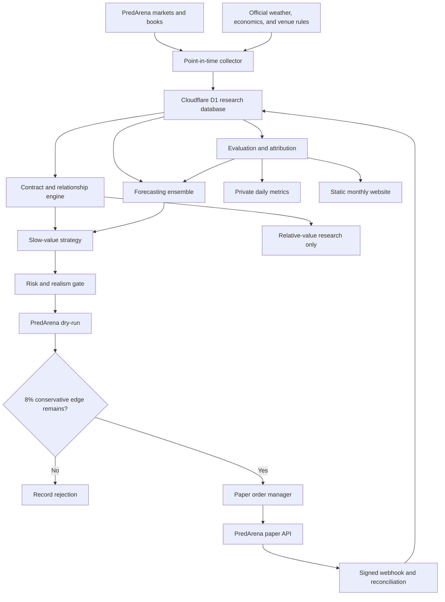

# Casus Strategies architecture

Casus has two separate surfaces: a private research engine and a public static website. The
browser never connects to the research database and never receives trading or model secrets.

## Why there are two databases

D1 holds the research history: facts, snapshots, forecasts, and paper fills. A small SQLite-backed
Durable Object serializes scheduled runs and webhooks. Think of D1 as the filing cabinet and the
Durable Object as the one-person order desk. This prevents two jobs from acting at the same time.

An hourly cron wakes the Worker, but a full cycle runs only at 8 AM, noon, 4 PM, and 8 PM New York
time. The 8 AM cycle selects at most 15 markets. Later cycles revisit only that saved watchlist.

## Point-in-time rule

Every source has three clocks:

- `source_published_at`: when the publisher says it released the information.
- `observed_at`: when Casus first saw it.
- `stored_at`: when the database finished saving it.

A forecast may only use information whose `observed_at` is not later than the forecast. This
simple rule prevents a historical evaluation from accidentally using knowledge from the future.

## Trust boundaries

- Only `PredArenaAdapter` talks to PredArena.
- Venue adapters read rules and prices; they cannot trade.
- Model clients produce validated research objects; they cannot call the paper broker.
- Deterministic code calculates probabilities, risk limits, sizes, and order eligibility.
- PredArena confirms positions. Sending a request is never treated as a fill.
- The public site contains sanitized month-end values only.

## Cost boundaries

The four research roles share one Groq key but have separate configurable model names. Identical
validated inputs are cached. Every attempted request reserves its estimated input and maximum output
before the network call, including failed calls. Static limits stop at 80% of the published free
daily token allowance, and returned Groq headers enforce the same 20% reserve for request and
per-minute token limits. Missing headers make the run ineligible to trade.

PredArena traffic is limited to eight requests per minute. A D1 counter allows at most two paper
order attempts per New York day and 800 per UTC month. Unknown execution or reconciliation state is
stored as a trading freeze, and only a later exact match can clear it.
